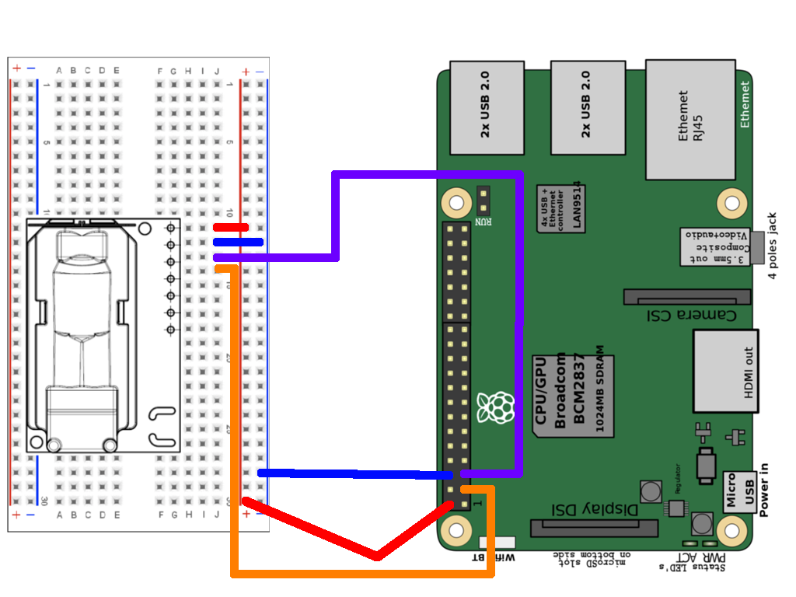

# Air-Monitor
To maintain a healthy work environment in the home office, different parameters are scanned and airing suggestions are sent via push notifications. The project is based on a raspberry pi and sensation SCD30 CO2 sensor.

# What you need
Raspberry pi (tested on model 3, but any other may work as well)
Sensirion SCD30 CO2 sensor
4 wires 

# Wiring scheme
This scheme presents how you hook up the sensor to the pi so they can communicate via the I2C protocol:


# Installation
* Set up your pi with a fresh pi OS 
* Wire up the sensor according to the scheme
* Turn on the raspberry pi and run `pip install scd30_i2c` in the terminal to install the python package for the sensor and `pip3 install apprise` for the push notification
* Next, we need to get the push notification running. To send notifications I use the pushover app. Create an account at [pushover.net](https://pushover.net) and create an application/API token. Give the application a nice name and make sure to save your API token/key, but do not share it with anyone. Also, make sure you have your user key, you find it on the main page in the upper right corner.
* Now you create an `auth.json` file and fill it with the following code, inserting your authentification credentials:
```json
{
 "key": "YOUR-KEY-HERE",
 "token": "YOUR-API-TOKEN-HERE"
}
```
* Start the app by navigating with the terminal into the repository and using  `python3 ./app.py`. You should see that the app automatically creates a database to store the data and populate it.
* Congratulations you are done! You should see a yellow LED blinking at the sensor. This indicates that the sensor started the measurement mode.
* Bonus: Use Linux crontab to start the air monitor automatically on reboot. Open the terminal again, type `crontab -e`, and choose your editor of preference (e.g. nano). You should be presented with a file that includes the crontab information. Add the following line to the bottom of the file and adjust the dependency path if necessary 
``` 
@reboot python3 PATH-TO-REPOSITORY-HERE/Air-Monitor/app.py > PATH-TO-REPOSITORY-HERE/Air-Monitor/out_log.txt
```
